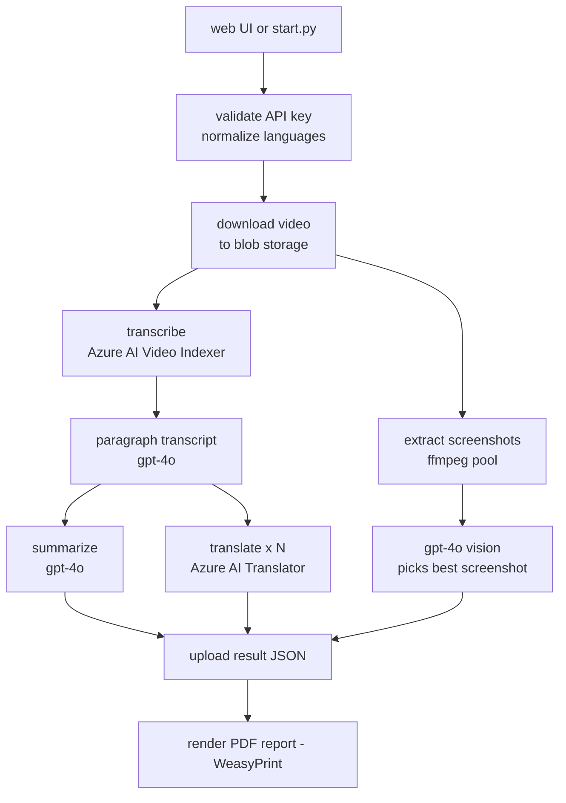
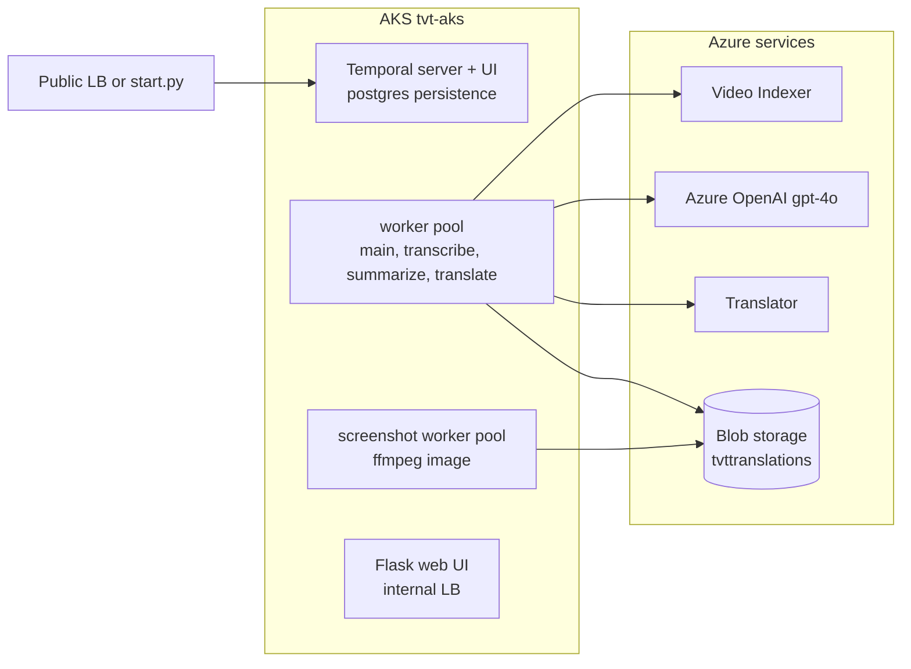

# temporal-video-translator

### Give it a video URL and it produces a transcript, a summary, translations into any number of languages, a representative screenshot, and a PDF report — orchestrated end to end as a durable Temporal workflow on AKS.

## Documentation

- **`docs/architecture.pdf`** — concise architecture/operations document (generated by the `archdoc` skill), embedding the diagrams below.
- **`docs/diagrams/`** — generated SVGs (regenerate with the `diagrams` skill):
  - `flow.svg` — the workflow's execution flow, step by step, showing what runs in parallel.
  - `temporal.svg` — Temporal topology: clients, server, task queues, and worker pools with their concurrency caps.
  - `infra.svg` — cloud infrastructure: AKS deployments, Azure services, ACR, identity, and networking.

## Example Outputs

- [Computing the Null Space of a Matrix](https://tvttranslations.blob.core.windows.net/pdf/video-translator-nullspace.mp4-c1165ecd-nullspace.pdf) ([json](https://tvttranslations.blob.core.windows.net/json/video-translator-nullspace.mp4-c1165ecd-nullspace.json)) — a linear algebra lecture on finding the null space of a matrix by row reduction to RREF and reading off the special solutions.
- [The Agora and Athenian Democracy](https://tvttranslations.blob.core.windows.net/pdf/video-translator-agora.mp4-317b406f-agora.pdf) ([json](https://tvttranslations.blob.core.windows.net/json/video-translator-agora.mp4-317b406f-agora.json)) — a history piece on the Athenian agora and the workings (and limits) of direct democracy in 5th-century BCE Athens.
- [Integration as the Reverse of Differentiation](https://tvttranslations.blob.core.windows.net/pdf/video-translator-integrals.mp4-4fbae108-integrals.pdf) ([json](https://tvttranslations.blob.core.windows.net/json/video-translator-integrals.mp4-4fbae108-integrals.json)) — a calculus lecture on integration as the reverse of differentiation, building the integral as the limit of summed areas under a curve.
- [Coolidge on Taxes and Government Spending](https://tvttranslations.blob.core.windows.net/pdf/video-translator-coolidge.mp4-0cf71cac-coolidge.pdf) ([json](https://tvttranslations.blob.core.windows.net/json/video-translator-coolidge.mp4-0cf71cac-coolidge.json)) — a Calvin Coolidge address on the tax burden of government spending and the case for cutting public expenses.

## Architecture

A single `VideoTranslatorWorkflow` (Temporal) drives the pipeline. Each Azure-bound stage runs on its own task queue with a per-pod concurrency cap matched to that service's quota. All Azure calls authenticate with Microsoft Entra ID via `DefaultAzureCredential` (service principal in-cluster, `az login` locally).

Everything runs in the `tvt-aks` cluster inside the `temporal-video-translator` resource group (eastus):

Note there are 2 pools of workers: a primary worker pool for typical tasks that are mostly orchestrating the use of Azure AI services, and a worker pool for compute-intensive FFMPEG operations. In practice, these FFMPEG workers could be GPU-enabled, high-memory, or otherwise special in their configuration.

## Major parts

- **Orchestration** — `tvt/temporal/`: the workflow, activities, shared dataclasses, worker, and CLI starter.
- **AI logic** — `tvt/ai/`: the `Summarizer`, `Paragrapher`, and `ScreenshotSelector` classes. Provider-neutral.
- **Azure clients** — `tvt/azure/`: shared Entra auth and blob storage; `tvt/azure/ai/`: the Azure-only AI services (Video Indexer, Translator) plus the OpenAI auth provider injected into `tvt/ai`.
- **Media** — `tvt/media/`: video staging, ffmpeg screenshots, result upload, and the PDF report renderer.
- **Web UI** — `tvt/web/`: submit runs and follow progress (reach via `web.sh`); `test.sh` submits from the CLI.
- **Workers** — two images from one Dockerfile: the main image (PDF/font stack) and a slim ffmpeg image for screenshots. Built/pushed by the `Makefile` to the `tvttranslator` ACR.
- **Helm chart** — `helm/temporal-video-translator/`: workers, web, self-contained Temporal server + postgres; secrets from a gitignored `secrets.yaml`.
- **Claude Code skills** — `.claude/skills/`: the `diagrams` and `archdoc` skills that regenerate the SVG diagrams and `docs/architecture.pdf` from the current code and Azure layout.
- **Run output** — result JSON, screenshot, and PDF report in public blob containers; URLs returned by the workflow.

