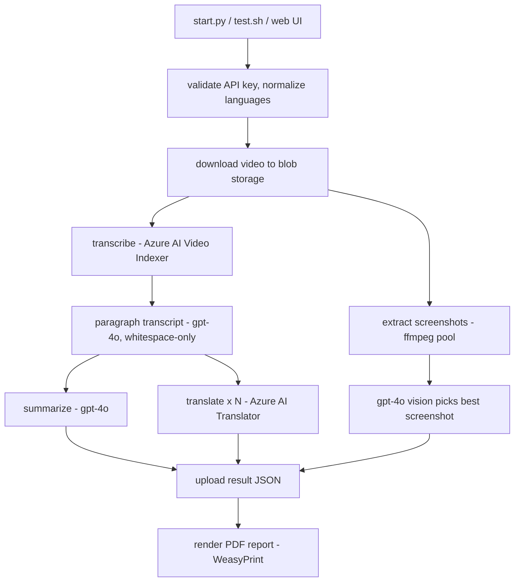
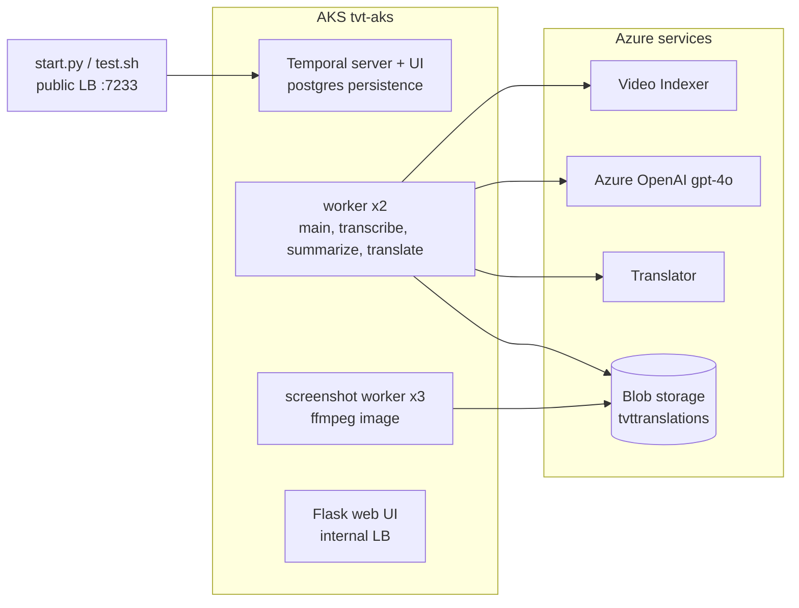

# temporal-video-translator

### Give it a video URL and it produces a transcript, a summary, translations into any number of languages, a representative screenshot, and a PDF report — orchestrated end to end as a durable Temporal workflow on AKS.

## Documentation

- **`docs/architecture.pdf`** — concise architecture/operations document (generated by the `archdoc` skill), embedding the diagrams below.
- **`docs/diagrams/`** — generated SVGs (regenerate with the `diagrams` skill):
  - `flow.svg` — the workflow's execution flow, step by step, showing what runs in parallel.
  - `temporal.svg` — Temporal topology: clients, server, task queues, and worker pools with their concurrency caps.
  - `infra.svg` — cloud infrastructure: AKS deployments, Azure services, ACR, identity, and networking.

## Architecture

A single `VideoTranslatorWorkflow` (Temporal) drives the pipeline. Each Azure-bound stage runs on its own task queue with a per-pod concurrency cap matched to that service's quota. All Azure calls authenticate with Microsoft Entra ID via `DefaultAzureCredential` (service principal in-cluster, `az login` locally).

Everything runs in the `tvt-aks` cluster inside the `temporal-video-translator` resource group (eastus):

## Major parts

- **Orchestration** — `tvt/temporal/`: the workflow, activities, shared dataclasses, worker, and CLI starter.
- **Azure clients** — `tvt/azure/`: one module per service (Video Indexer, OpenAI, Translator, blob storage) plus shared Entra auth; each runnable as a CLI via `python -m`.
- **Media** — `tvt/media/`: video staging, ffmpeg screenshots, result upload, and the PDF report renderer.
- **Web UI** — `tvt/web/`: submit runs and follow progress (reach via `web.sh`); `test.sh` submits from the CLI.
- **Workers** — two images from one Dockerfile: the main image (PDF/font stack) and a slim ffmpeg image for screenshots. Built/pushed by the `Makefile` to the `tvttranslator` ACR.
- **Helm chart** — `helm/temporal-video-translator/`: workers, web, self-contained Temporal server + postgres; secrets from a gitignored `secrets.yaml`.
- **Run output** — result JSON, screenshot, and PDF report in public blob containers; URLs returned by the workflow.

